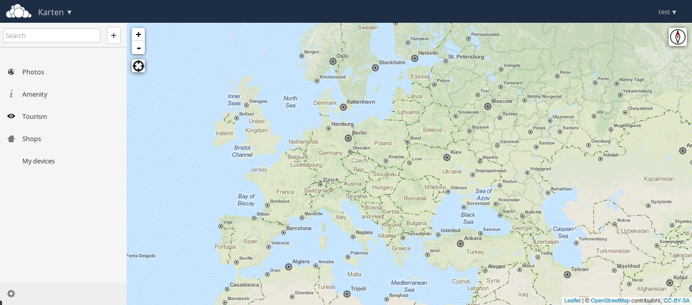

# Maps

Place this app in **owncloud/apps/**

## What is this?
This app displays openstreetmap layers including POIs.
It supports searching for cities and addresses.
Additionally it is possible to display (and search for) contacts and gpx/gps tracks (WIP, see issues for more information).

## Screenshots

## Running tests
After [Installing PHPUnit](http://phpunit.de/getting-started.html) run:

    phpunit

##Sources
- OpenLayers https://github.com/openlayers/openlayers

##Support
Only MYSQL is supported
