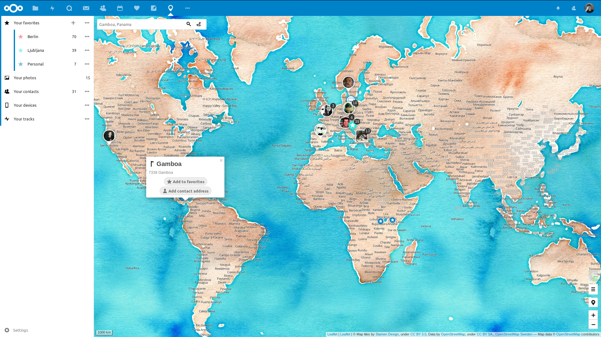

# Nextcloud Maps

**🌍🌏🌎 The whole world fits inside your cloud!**

- **🗺 Beautiful map:** Using [OpenStreetMap](https://www.openstreetmap.org) and [Leaflet](https://leafletjs.com), you can choose between standard map, satellite, topographical, dark mode or even watercolor! 🎨
- **⭐ Favorites:** Save your favorite places, privately! Sync with [GNOME Maps](https://github.com/nextcloud/maps/issues/30) and mobile apps is planned.
- **🧭 Routing:** Possible using either [OSRM](http://project-osrm.org), [GraphHopper](https://www.graphhopper.com) or [Mapbox](https://www.mapbox.com).
- **🖼 Photos on the map:** No more boring slideshows, just show directly where you were!
- **🙋 Contacts on the map:** See where your friends live and plan your next visit.
- **📱 Devices:** Lost your phone? Check the map!
- **〰 Tracks:** Load GPS tracks or past trips. Recording with [PhoneTrack](https://f-droid.org/en/packages/net.eneiluj.nextcloud.phonetrack/) or [OwnTracks](https://owntracks.org) is planned.

Future plans:
- **📆 Events on the map:** Know where you need to go next!
- **🗺 Different projections:** The [Mercator projection](https://en.wikipedia.org/wiki/Mercator_projection) is very biased, as you can see from [The True Size of Africa](http://kai.sub.blue/en/africa.html). Another view like the [Gall-Peters projection](https://en.wikipedia.org/wiki/Gall%E2%80%93Peters_projection) would be a possibility.

## 🏗 Development setup

This requires that you [install node and npm](https://www.npmjs.com/get-npm).

1. ☁ Clone this app into the `apps` folder of your Nextcloud: `git clone https://github.com/nextcloud/maps.git`
2. 👩‍💻 In the folder of the app, run the command `make` to install dependencies and build the Javascript.
3. ✅ Enable the app through the app management of your Nextcloud
4. 🎉 Partytime! Help fix [some issues](https://github.com/nextcloud/maps/issues) and [review pull requests](https://github.com/nextcloud/maps/pulls) 👍

## Admin documentation

Media scans are performed with the regular system background job.

Scans can also be manually triggered via occ command:

`./occ maps:scan-photos` to rescan photos' GPS exif data

`./occ maps:scan-tracks` to rescan track files
